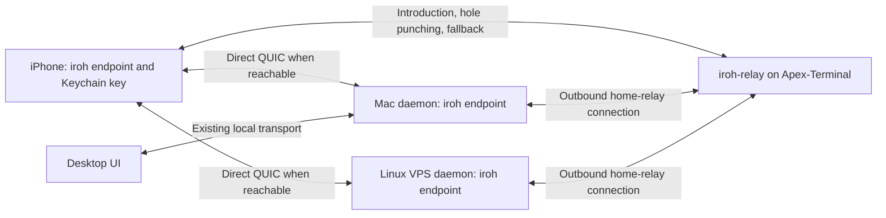

# Built-in remote access for Apex Deck

Draft for review · 2026-10-07 · Revised to build on iroh and iroh-relay · Milestone 1 in progress; the Apex-Terminal relay is deployed, but production remote access is not enabled.

## Recommended product

Install the desktop companion, choose **Pair phone**, scan its QR code in Apex Deck, and approve the phone on the desktop. The phone then connects from Wi-Fi or cellular without entering IP addresses, creating a service account, installing a VPN, or configuring a router. Pair each machine independently; a Linux VPS runs its own daemon and remains available when the Mac sleeps. Remote access requires that the selected host is awake and its daemon is running.

Default to **Automatic**: prefer an end-to-end encrypted direct connection (LAN, public address or hole punching) and fall back to our **iroh-relay on Apex-Terminal** when no direct route works. Keep the existing local desktop and SSH transports. Offer **Direct only** under Advanced settings for users who do not want session traffic relayed. Remote access does not wake a sleeping Mac or run its agents in the cloud.

Assumptions: macOS desktop, Capacitor iPhone client, and the Rust daemon on Ubuntu are the first supported endpoints. First beta target: 100 registered hosts and 20 simultaneous active phone sessions. Public rollout target: 1,000 registered hosts and 100 active sessions, subject to measured load. These are sizing targets, not tested capacities.

## Existing foundation and design changes

The production phone lives in `src/phone/`, rather than the separate `ios/` design prototype. `src/phoneBackend.ts` opens one daemon client per machine; `src/daemon/client.ts` already handles reconnects and resumes using `boot_id` and event sequence. `crates/apex-daemon/src/protocol.rs` supplies the shared command/event protocol, bounded replay, and token authentication. Current phone machine settings contain a direct address and token and are serialized to localStorage.

The agreed [remote specification](superpowers/specs/2026-10-05-remote-and-electron.md) already calls for Ed25519 device identities, five-minute QR pairing, revocation, and permission tiers, and names iroh for future transport. This plan keeps the host-owned state and device model and adopts iroh as the transport from the first remote release. Update the specification to match before implementation.

## Why iroh

[iroh](https://www.iroh.computer/) (MIT/Apache-2.0, maintained by n0) already does the networking this plan needs, so we do not design or operate a custom helper protocol.

| iroh provides | We still build |
| --- | --- |
| Endpoint identity: each endpoint is an Ed25519 key, and dialing an endpoint ID authenticates that exact key | Mapping endpoint IDs to authorized phones and permission tiers on the host |
| QUIC with TLS 1.3 encryption on every path, including through the relay | Our application protocol over QUIC streams (existing command/event frames) |
| Direct LAN/public/IPv6 paths, hole punching, and automatic relay fallback and upgrade | Automatic vs Direct only policy and the Direct/Relayed indicator |
| `iroh-relay`, a self-hostable relay that forwards encrypted packets it cannot read | Deploying and operating it on Apex-Terminal |
| Swift bindings ([IrohLib](https://docs.iroh.computer/languages/swift), via iroh-ffi/uniffi) with a prebuilt iOS xcframework | A Capacitor plugin that wraps it for the web UI |

What this removes from the earlier draft: the custom Noise handshake, relay login credentials, relay-side revocation, the helper control API, and relay-side storage of device records. Authorization lives only on the host.

Main risk: the Swift bindings must expose what we need (custom relay map, secret key import, connection-path status, ALPN, streams). If they do not, we write a thin uniffi crate over the Rust library ourselves. Milestone 1 settles this on the real iPhone app.

## Architecture

Each daemon and phone runs an iroh endpoint configured with only our relay (`RelayMode::Custom`, no n0 defaults in production). Each daemon keeps an outbound connection to that relay as its home relay, so a phone can reach it by endpoint ID without the Mac opening a port. The relay introduces the two endpoints, iroh tries direct paths and hole punching, and traffic moves to a direct path when one works. If none works, the relay keeps forwarding the encrypted QUIC packets for that session.

Discovery: the QR code carries the host's endpoint ID, relay URL and any known direct addresses, and the phone stores them. We do not depend on n0's DNS discovery service. With one relay, the host's home relay never changes, so stored addresses stay valid. If we add more relays later, self-host `iroh-dns-server` or another discovery method then.

The relay sees endpoint IDs, IP addresses, connection times and, for relayed sessions, traffic volume. It cannot read commands, transcripts, attachments or approvals. Endpoints necessarily see plaintext, so end-to-end encryption does not protect a compromised phone or computer.

## Connection modes and route selection

- **Automatic (default):** let iroh pick the best path, with our relay as fallback. A public VPS or a Mac with a forwarded port/DDNS address should end up direct when reachable. Do not promise a direct-connection success rate until the spike measures one.
- **Advanced → Direct only:** enforced at the transport, not by the app watching the Direct/Relayed indicator. Checking a path status before sending races with iroh's automatic fallback: QUIC packets can move to the relay before the app sees the change. The default design is a separate Direct only endpoint built with the relay disabled, dialing only the addresses the phone already has (QR/stored direct addresses, LAN, VPS IP, DDNS + forwarded port). That loses relay-assisted hole punching. A relay-introduced variant (relay carries introductions only, never session packets) ships only if the spike proves iroh can enforce that per connection; a status check is not proof.
- **Direct only explanation:** “Connects without relaying your session. Home routers and cellular networks may block direct access; you may need port forwarding or firewall changes. If a direct connection cannot be made, Apex Deck will remain disconnected.”

Show **Direct** or **Relayed** for the active route and explain failures with host/firewall guidance. Turning on Direct only closes an existing relayed session; never silently fall back against that preference. Do not automatically open router ports or change VPS firewalls without an explicit setup action. iroh maps ports automatically (UPnP, NAT-PMP, PCP) by default, so explicitly disable its port mapper on every endpoint, phone and host, in every build; the spike confirms the bindings expose that switch.

### Direct only identity and addresses

Automatic and Direct only retain the same permanent endpoint ID on each device; switching modes never creates a new key or requires re-pairing. Import the saved secret key into the relay-disabled endpoint. Close affected connections before switching and reopen them under the selected policy. Do not assume two simultaneous endpoints using the same key are supported: milestone 1 must validate the host listener arrangement, including serving Automatic and Direct only phones concurrently without introducing a relay path into the latter. If the bindings cannot support this safely, resolve the endpoint architecture before shipping either mode.

The daemon binds a stable, configurable UDP port and advertises its actual listening addresses in the QR and in authenticated address updates. Store addresses separately from the pinned host endpoint ID: addresses locate the host but never establish trust. Keep LAN addresses scoped to the local network; for outside access, accept an explicitly configured VPS address or DDNS hostname and external UDP port mapped to the daemon port. Resolve DDNS again on reconnect, and authenticate the same pinned endpoint ID even when its IP changes. Do not treat a private LAN address as remotely reachable or assume DDNS opens a firewall. Automatic can refresh address hints over an authenticated session; Direct only uses LAN discovery and saved or manually updated addresses without contacting the relay. If every saved route becomes stale, show address/firewall guidance and allow an address edit or a fresh local QR scan without replacing the paired identity. The spike must verify explicit address dialing, stable port binding and address refresh in the Swift bindings.

Run the existing daemon protocol over a QUIC bidirectional stream under a versioned ALPN (for example `apex-deck/1`), with separate ALPNs for pairing and recovery. QUIC handles ordering, flow control and backpressure. Keep an explicit attachment size limit instead of the daemon's current 32 MiB frame allowance.

## QR pairing

1. The host creates its permanent iroh secret key on first launch. **Pair phone** creates a random 256-bit secret and an invitation ID, expiring after five minutes. Only one phone can complete an invitation.
2. A versioned QR/deep link contains the host endpoint ID, relay URL, optional direct addresses, invitation ID, secret and expiry. The scanner accepts only supported versions and allowlisted relay URLs.
3. The phone creates its own iroh secret key (stored in Keychain) and dials the host endpoint ID on the pairing ALPN. Because iroh authenticates the dialed key, the relay cannot substitute a different host. This closes the key-swap weakness we found in Happy's pairing.
4. Inside the encrypted connection, the host sends a fresh random challenge. The phone answers with an HMAC, keyed by the invitation secret, over a domain-separated transcript: protocol version, invitation ID, host challenge, host endpoint ID and phone endpoint ID, both as authenticated by iroh (not as claimed in a message), plus TLS keying material if the bindings expose it. The fresh challenge stops a captured proof from being replayed on another connection; the authenticated IDs stop it being reused for a different phone or host. The secret never goes to the relay in readable form. No daemon commands are allowed on the pairing connection.
5. Both screens show the same short verification code, derived from that same transcript so it changes if either endpoint or the challenge differs. The desktop shows the phone label and chosen permission tier; the user approves. A copied QR is a temporary capability, so approval is always required.
6. The host atomically stores the phone's endpoint ID and permissions and consumes the invitation. The phone saves the host endpoint address and opens its first normal session.

Headless hosts expose the same flow through `apex-daemon pair`, printing a QR/deep link and a confirmation prompt over the user's existing SSH session. Offer camera permission only when scanning and a pairing link as an accessibility fallback, with the same approval and expiry rules.

## Identity, encryption, and authorization

Device identity is the iroh endpoint key. iroh's QUIC/TLS 1.3 provides authenticated encryption with fresh session keys per connection, so we do not add a separate handshake or custom cryptography. Pin the same iroh version range on phone and daemons, and add an application-level protocol version so incompatible builds fail with **Update required**.

Store the phone's secret key in iOS Keychain with a device-only protection class suitable for foreground access; store Mac keys in Keychain and Linux keys in owner-only files. Exclude them from localStorage, logs, analytics, crash reports and cloud backup. The Capacitor plugin keeps the key and connection in native code and exposes only message send/receive to the web UI; the host must still defend against a compromised UI sending authorized requests.

The host checks the remote endpoint ID against `authorized_devices` on every accepted connection, command and stream subscription. Add a device-aware session context to the protocol; do not map remote sessions to `Trust::Local` or reuse the shared LAN token as remote authority.

| Host-selected tier | Allowed behavior |
| --- | --- |
| Read-only | View allowed threads, state and diffs; no mutations, terminal input, or unrestricted file reads |
| Chat + approvals (default) | Read allowed state, send chat, and decide eligible host approval requests |
| Full | Explicitly granted terminal, file and browser-control capabilities, still subject to host rules and OS permissions |

Define a command-by-command allowlist and event filtering, including paths, workspace boundaries, subscriptions, and read operations that expose secrets. A phone cannot raise its own permissions, enroll another phone, change recovery credentials, or revoke peers unless the host separately grants device-administration authority. Keep browser control out of the first remote milestone. Approval IDs must identify an outstanding host request; stale or already-resolved approvals fail safely.

## Revocation

Desktop **Settings → Paired devices** shows name, enrollment time, permissions, and last activity. **Revoke** persists a tombstone for that endpoint ID, closes its open connections, removes subscriptions and cancels control leases. Because the host checks every connection and command, the relay plays no part in revocation and cannot restore access. Already-started host work may continue and is reported separately.

An offline host applies revocation when it next runs; say so plainly. Revocation does not retract content already on the phone. Revoked phones show **Access removed — pair again on this machine** and stop retrying.

## Reconnects and uncertain delivery

Reuse `DaemonClient` behind an iroh-backed `Link`. Add jitter to its existing 1, 2, 4, 8, 16, 30-second backoff and reconnect on foreground and network changes. iroh handles path changes (Wi-Fi to cellular, direct to relayed) inside a connection where it can; when the connection drops, open a new one, then replay from `(host_id, boot_id, seq)`. If the host restarted or replay history expired, do a snapshot resync and keep writes disabled until catch-up completes. A failure on one host must not disconnect the others. A relay outage must not interrupt an established direct session, and configured direct addresses should still connect.

Distinguish **Computer offline**, **Reconnecting**, **Catching up**, **Relay unavailable**, **Direct connection blocked**, **Access removed**, and **Update required**. iOS suspends sockets in the background; reconnect on foreground rather than promising a permanent background connection. Push notifications are a later milestone. A closed desktop currently may stop its sidecar; make companion lifetime visible and support an explicit background service if remote access must outlive the desktop window.

Never automatically repeat terminal input, approvals, or uncertain mutations. Add stable operation IDs and host-persisted deduplication for retryable chat and other selected mutations before allowing resend. The same ID and payload return the known outcome; a different payload with the same ID is rejected. After the retention window, report uncertainty rather than rerunning. Preserve the phone's current user-controlled queue/resume behavior.

## Recovery without mandatory accounts

The normal path: use the desktop or SSH to revoke the lost phone and pair a replacement. Reinstalling the phone creates a new identity and requires pairing. Losing the phone does not affect host-owned threads or work.

Offer **Save recovery kit** during setup, without blocking pairing. The kit holds a separate per-host recovery key, its generation, the pinned host endpoint ID, relay URL and known direct address hints. The host stores only the recovery public key and a durable generation counter. Anyone holding the kit can take over phone access; say so when exporting it.

**Beta bootstrap:** a replacement or reinstalled phone has a new endpoint ID, which is not on the relay allowlist. Before remote recovery, show that ID with a copy button and instructions for the beta operator to approve it through the existing tester-support channel. The operator verifies the tester through that channel and adds only relay access; never request the recovery kit or secret. Once approved, the phone can reach the recovery ALPN, where the host still requires the recovery proof. Alternatively recover directly on the same LAN or through a reachable VPS/DDNS address, or use desktop/SSH access to pair normally; these paths need no relay approval. Until one path is available, display **Relay access approval required** rather than claiming the host is offline. Public rollout must define replacement-device bootstrap alongside its relay access policy; relay admission must never itself grant host authority.

On the encrypted recovery connection, the host sends a fresh random challenge and its current recovery generation. The replacement phone signs a domain-separated, canonically encoded transcript containing the recovery protocol version, challenge, both host and replacement-phone endpoint IDs as authenticated by iroh, and the recovery generation; include TLS channel-binding material if available. The phone checks the pinned host ID and kit generation before signing. The host checks the signature against the current recovery public key, verifies both IDs against this connection, and accepts the challenge only once on this connection with a short expiry. Reject stale generations, reused challenges and proofs copied to another endpoint or connection. Recovery connections permit no normal daemon commands.

A successful recovery atomically revokes existing phones, closes their connections, enrolls the authenticated replacement ID at the configured recovery permission ceiling, and advances the generation with a replacement recovery public key. Persist that transaction before granting normal access; concurrent attempts with the old kit cannot both succeed. Deliver the new kit over the authenticated encrypted connection and require acknowledgement that it was saved, with an authenticated retry path if delivery is interrupted. The old kit stays invalid after commit; interrupted export must not roll back revocation or reuse the old generation.

Recovery needs a reachable host. No kit and no host access means no remote recovery; support cannot bypass encryption. Reinstalling a host without restoring its identity makes it a new machine that must be re-paired. Accounts, cloud backup and billing remain separate future features.

## Relay on Apex-Terminal

Run the open-source `iroh-relay` binary on the existing Apex-Terminal VPS under a dedicated hostname (for example `relay.apex-terminal.xyz`), as a systemd service with resource limits and log rotation. Keep its data and logs on `/data`, since the root disk is nearly full. Use a relay version matching the iroh version in the apps.

- **Ports:** 443/TCP (relay), 80/TCP (Let's Encrypt certificate provisioning), 7842/UDP (QUIC address discovery), and optionally 9090 for metrics bound to localhost.
- **Certificates:** iroh-relay's built-in Let's Encrypt mode, or a manual certificate.
- **Access (beta):** an allowlist of tester endpoint IDs, hosts and phones. Encryption keeps strangers from reading traffic but not from using our bandwidth. The phone shows its endpoint ID under **Settings → Remote access** with a copy button, and the operator adds it to the relay config. Until an ID is listed, that phone can still pair and connect on the same network but not through the relay. This is relay access only, not authorization: the host still decides who gets in, and removing a phone from the list does not revoke it.
- **Access (public):** a hand-kept list does not scale. Decide in milestone 5 between iroh-relay's HTTP access check (`access.http`) backed by a small service, rate limits per endpoint, or open access with a denylist. This is not a login system for users.
- **Development:** dev builds may use n0's free public relays; production builds use only our relay.

The beta relay configuration durably stores the endpoint allowlist, including replacement IDs approved for recovery bootstrap; it stores no host permissions, recovery credentials, or messages. Connection maps live in memory, so a relay restart only causes reconnects.

## Hosting costs and operating plan

This plan does **not** require a new paid server or a user subscription; the relay runs on the existing VPS. Costs that may appear later: bandwidth beyond the VPS allowance, monitoring, and a second relay for redundancy. No relay memory, CPU or bandwidth has been measured yet; measure the deployed relay before stating capacity.

Relay bandwidth only applies to relayed sessions. Estimate monthly relay traffic as **active session minutes × measured relayed fraction × bytes per minute**, both directions. Text sessions and attachment-heavy sessions need separate measurements. Before public rollout, decide whether a single-relay outage is acceptable (direct sessions keep working) or add a second relay.

Observe connection counts, relayed vs direct share, reconnect rates, pairing failure stages and bytes forwarded; never log pairing secrets or plaintext. Targets to validate: reconnect within 10 seconds after networking returns; online revocation closes access within two seconds. Apply relay security updates on a schedule.

## Implementation milestones and acceptance

1. **iroh spike.** Wrap IrohLib in a Capacitor plugin, add an iroh endpoint to the daemon, and run iroh-relay on Apex-Terminal. Confirm the Swift bindings expose custom relays, key import, path status, streams, a relay-disabled endpoint and the port-mapper switch, stable UDP ports, explicit address dialing and same-identity listener behavior across modes. Test whether iroh can keep session packets off the relay per connection (decides the Direct only variant). Exit: the real iPhone app on cellular reaches the home Mac and the VPS, shows Direct or Relayed correctly, survives Wi-Fi/cellular switches, and has measured relay load. No remote production commands yet. Reassess export compliance for bundled iroh cryptography before the first encryption-enabled TestFlight upload; do not defer this to public rollout. The local echo harness and build procedure are documented in [the mobile spike](iroh-mobile-spike.md).
2. **Device authority.** Add persistent authorized devices keyed by endpoint ID, host permission checks, settings UI/CLI and revocation. Exit: exhaustive command/subscription permission tests, no self-escalation, durable revoke across restarts.
3. **QR pairing and connection modes.** Build pairing, verification code and approval, Keychain storage, Automatic/Direct only and route status; add headless pairing. Exit: pairing works direct and relayed; expiry, competing scans, wrong secret, wrong host key, untrusted relay URL and invitation replay, proof replay on a new connection and a proof bound to a different endpoint ID fail; a packet capture on the relay shows no session data in Direct only, including during a forced path change; no router port mappings appear.
4. **Reconnect and recovery.** Add jitter/foreground handling, cursor persistence, snapshot resync, mutation deduplication and the recovery kit. Exit: route changes, relay outages, process restarts, expired replay, kit rotation and multi-host isolation pass on real hardware. Test replacement-phone relay approval and direct bootstrap, stale DDNS/address repair, concurrent recovery, interrupted kit export, and rejection of recovery proofs with a wrong endpoint ID, stale generation or replayed challenge.
5. **Public rollout readiness.** Load test the relay, decide on redundancy, get an independent security review of pairing and authorization, document privacy and retention, and reassess the App Store export-compliance answer for the added encryption. Exit: no unresolved critical findings and a TestFlight pilot where first-time users enter no IP address.

Rough estimate for one engineer: 1 week for the spike, 1–2 for authority, 1–2 for pairing and modes, 1–2 for reconnect/recovery, and 1 for rollout: about 5–8 engineer-weeks, to be revised after the spike. Ship behind a remote-access flag, keep LAN/SSH working, and keep a kill switch that disables relay use without weakening encryption.

Review decisions before implementation: Capacitor plugin over IrohLib vs our own uniffi crate; relay-introduced Direct only if the spike proves transport enforcement (strict is the default); relay hostname and VPS capacity; exact permission boundaries; recovery permission ceiling; companion background lifetime; public relay access policy after the beta allowlist.
