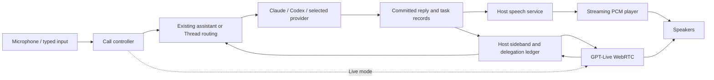

# Natural voice for Apex Deck

Status: proposed design and implementation handoff; planning only. No voice implementation or live provider test was performed for this document.

Prepared 2026-10-10 against checkout `22058d74693ecd451b393395b079ea514bb0d021` (v0.5.1), then reviewed against `486f5f7` on resumption. The voice, host command, authority, and transport files examined here have no changes between those commits. Other untracked mockups and planning files are present. Execution must recheck the checkout and preserve unrelated work.

## Outcome and scope

The human wants the assistant to sound natural, using BridgeMind as a reference. The recommended sequence is:

1. **Natural speech:** keep the existing answering models and replace device-default speech with expressive, streamed TTS.
2. **Live conversation:** offer GPT-Live as an explicitly labeled conversational voice layer that delegates work to Apex Deck's existing agents.
3. **iPhone background conversation:** add an opt-in native Live call that keeps listening and speaking while the user switches apps or locks the screen. This is required phone scope, with its own acceptance gate; desktop releases can ship independently.

Planning assumption: keeping Claude/Codex and Apex Deck's agent controls matters more than replacing the harness with a single audio model. The recommendation can be reordered if the human prioritizes live conversation.

Success requires audible improvement in the native app, clean interruption, accurate model attribution, retained chat/task history, and tests with both Claude and Codex. Passing a browser mock or seeing a waveform does not establish voice quality.

The first release targets the existing personal-assistant call on macOS. The same speech service then supports a selected participant in a Thread. The second release adds hands-free full-duplex conversation. The third release makes active Live conversation independent of the iPhone web UI and supports background and screen-lock use. No wake word, voice cloning, incoming telephony, new hosted Apex service, or replacement of existing provider adapters is included. An ended or terminated call does not listen in the background.

Implementation plans:

- [Release 1: natural speech](../plans/2026-10-10-apex-natural-speech.md)
- [Release 2: live voice](../plans/2026-10-10-apex-live-voice.md)
- [Release 3: iPhone background conversation](../plans/2026-10-10-apex-ios-background-voice.md)

## What is verified in the current source

| Evidence | Implication |
| --- | --- |
| [personalSpeech.ts](../../../src/personalSpeech.ts) creates `SpeechSynthesisUtterance` and calls `speechSynthesis.speak` without selecting a voice, rate, pitch, or delivery style. | Device-default synthesis is the principal source-level explanation for robotic speech. No listening test has established its actual sound. |
| `spokenText` removes Markdown and collapses all whitespace. | Paragraph structure and pauses are lost. Code fences become a chat pointer, which is useful and should be retained without repeating it. |
| [PersonalCall.tsx](../../../src/PersonalCall.tsx) queues completed messages, handles barge-in through the Talk button, and has output mute. | It is a turn-based call; its single phase cannot represent simultaneous listening, speaking, and background work. Errors from speech are swallowed. |
| [personalAssistant.ts](../../../src/personalAssistant.ts) polls every 2.5 seconds and sends with `personal_send`; the initial profile is Claude Code. | There is additional reply-detection latency. The personal assistant is not currently an automatic Claude/Codex switcher. |
| [personal_worker.rs](../../../crates/apex-host/src/personal_worker.rs) waits for `ReasonOut`, parses a structured reply, then commits chat/tasks together. | TTS can stream audio after a reply commits. Streaming the model's structured JSON prematurely would expose control data and unverified task claims. |
| [types.ts](../../../src/types.ts) has Thread `delta`, `message_added`, `turn_started`, and `participant_idle` events. Thread messages use numeric `seq`; personal messages have string `id`. | Use discriminated source references and content hashes; do not assume both lanes have a string message ID. Start by speaking committed messages; token-level speech is a separate optimization. |
| [main.mjs](../../../desktop/main.mjs), [Cargo.toml](../../../Cargo.toml), and [package.json](../../../package.json) define Electron + Rust daemon. | BridgeMind's Tauri invoke/Channel transport is a reference, not an Apex runtime dependency. |
| [keys.rs](../../../crates/apex-adapters/src/keys.rs) provides host-owned key lookup; macOS uses Keychain and other hosts use the restricted file store. | Reuse credentials. The renderer receives key status, never key values. |
| [authority.rs](../../../crates/apex-daemon/src/authority.rs) forbids remote API-key commands and requires Full/global access for the personal assistant. | New voice commands must preserve those boundaries; a paired phone must not gain access to key management or unrelated Threads. |
| [events.rs](../../../crates/apex-host/src/events.rs) retains a replay buffer. | Audio cannot be broadcast on the general host event bus or replayed after reconnect. |
| [SpeechPlugin.swift](../../../iphone/App/App/SpeechPlugin.swift) uses Apple recognition and a `.measurement` audio session. | Do not run this recognizer simultaneously with a full-duplex voice capture session. Apple recognition can use Apple's service; existing “on this device” copy overstates locality. |
| [SceneDelegate.swift](../../../iphone/App/App/SceneDelegate.swift) installs `AppBridgeViewController`; [ApexRemotePlugin.swift](../../../iphone/ApexRemote/Sources/ApexRemote/ApexRemotePlugin.swift) routes native iroh events to JavaScript and owns shutdown through the plugin. | Background calls need a native RPC/event consumer and app-owned transport lease. Adding background audio or a capture plugin alone leaves control/delegation dependent on suspended JavaScript. Register voice on the actual scene controller, not the other controller in SpeechPlugin.swift. |
| [Info.plist](../../../iphone/App/App/Info.plist) has mic/speech disclosures but no `UIBackgroundModes` audio entry. | Enable background audio for real, user-started voice use and update the disclosure. This checkout has no verified background voice support. |

## BridgeMind reference and limits

Recovered reference root: `/Users/tylercaldwell/Downloads/REA/recovery/frontend-readable/assets/`.

| Reference | Reuse as a design pattern | Adaptation |
| --- | --- | --- |
| `bridgeRealtime-BQQyIFpm.js` | PCM16 conversion at 24 kHz, microphone constraints, output scheduling, RMS meters, mute/stop cleanup. | Use `AudioWorklet` for a new PCM player/capture path; preserve sample boundaries and test real sample rates. Do not copy the `ScriptProcessor(4096)` implementation or strict automatic-gain checks without platform testing. |
| `bridgeLive-BKY3nmkN.js` | Startup state, bounded queues, explicit session closure, transcript fragments, request-ID checks, default `marin`. | Its custom gateway uses `bridge.start`; direct OpenAI WebRTC setup uses the documented Live session API instead. |
| `bridgeLiveNativeSocket-CzeIr_Im.js` | Native authentication boundary, serialized sends, early-message limits, late-open cleanup. | Replace Tauri calls with Apex's authenticated daemon connection and server-side session management. |
| `agentVoiceCall-DT2RImPx.js`, `bridgeToolRegistry-Clxk20A7.js` | Bounded agent context, activity/status separate from conversation, validated results. | Retain Apex's Threads, participant identities, routing, approvals, task receipts, and access settings. |
| `bridgeConversationInstructions-Vrs_xLnO.js` | Separate conversational style from instructions for the working agent. | Write an Apex-specific prompt; do not import BridgeMind's identity or cloud assumptions. |

The shipped client expects `gpt-live-1`, `/voice/live/ws`, and a BridgeMind ticket. Its gateway's upstream execution has not been observed. Current official GPT-Live docs now document matching model/event names, making GPT-Live the closest documented replacement. BridgeMind's client handles nested Responses-delegation events; Apex will use **client delegation** to retain its own agents. This distinction changes the protocol substantially.

No reconstruction of BridgeMind's hosted server, entitlement system, ticket minting, or private endpoint is required. The original recovered frontend remains unchanged in REA.

## Approaches and choice

| Approach | Benefit | Tradeoff | Decision |
| --- | --- | --- | --- |
| Expressive TTS for existing replies | Direct improvement to robotic speech; exact Claude/Codex wording; lowest disruption. | Recognition and model generation remain separate; cannot hear vocal tone; initial release waits for a committed reply. | Release 1. |
| GPT-Live with Apex client delegation | Natural ongoing conversation while existing agents do work; matches the BridgeMind direction. | Additional audio provider, transcript/context ownership, paraphrased results, session duration billing. | Release 2. |
| Single Realtime model as the agent | Fewer boundaries for an audio-first assistant. | Changes who answers and how work executes; less faithful to Apex's multi-model product. | No separate Realtime implementation in this scope. |

Start Release 1 with `gpt-4o-mini-tts`, `marin`, and an audition for `cedar`. Use a short style instruction such as “Speak conversationally, with natural pauses and varied intonation. Keep technical names clear.” Choose the final voice by listening. This is a proposed starting configuration, not a guarantee of naturalness. [Official TTS guidance](https://developers.openai.com/api/docs/guides/text-to-speech)

For Release 2, use `gpt-live-1`, client delegation, and `marin` initially, with `cedar` available for audition. Voice changes apply to a new call because the running Live session's voice is immutable. Validate access with the execution host's project API credentials before enabling the mode. The voice model and the working agent remain distinct. [GPT-Live overview](https://developers.openai.com/api/docs/guides/live), [session voice configuration](https://developers.openai.com/api/reference/resources/live/methods/create)

## Architecture

The voice service runs on the conversation's host in these releases. For a personal assistant on a VPS, that is the VPS; for a local Thread, it is This Mac. This avoids exporting an unrelated host's history to a second voice host. Show the host in Voice settings and the call. Cross-host voice-service routing is outside this plan.

The client owns capture, playback, output mute, device selection, and the current call lifecycle. On desktop that owner is the renderer controller; on iPhone background Live calls it is an app-owned native coordinator, and React only observes or sends explicit controls. The Rust host owns provider credentials, policy checks, upstream requests, session ownership, delegation correlation, cost accounting, and durable messages/tasks. One local audio lease permits only one call/preview to play or capture at a time.

## Global constraints

- Use the existing Electron + Rust daemon architecture; add no Tauri dependency.
- Keep cloud voice off until explicitly selected; preserve device speech and typed input.
- Keep API credentials on the execution host; reuse `OPENAI_API_KEY` through the existing key store.
- Keep raw audio, credentials, SDP, and live transport handles out of saved sessions, replay buffers, exports, and logs.
- Keep audio events scoped to the initiating connection; do not broadcast or replay them.
- Preserve participant identity, Thread routing, reasoning/access/persona settings, approvals, and task receipts.
- Stop local output immediately on output mute, audio interruption, owner disconnect, or End call; discard late audio by generation. Web-owned calls also stop on unmount; native iPhone calls survive UI detachment. Microphone mute affects input independently.
- Ending a call does not cancel existing agent work; cancellation remains a separate task action.
- A cloud-provider error is visible; switching to device speech requires an explicit user choice.
- Verify audio on a packaged native build; mocks and builds do not establish naturalness.
- iPhone background Live calls require explicit opt-in and native audio/transport ownership; app switching, screen lock, and UI detachment do not end an opted-in active call.
- Start or resume microphone capture only through explicit user action; interruptions, lost ownership, and app termination require a new foreground start/resume.
- Background audio supports active voice use only; never use silent playback, background-task timers, or push notifications to keep an idle microphone alive.

## Release 1 contract: natural speech

Create focused modules under `src/voice/` and `crates/apex-host/src/voice/`. Keep `personalSpeech.ts` as a device-recognition/device-TTS adapter while the new controller owns lifetime and playback.

The UI chooses `device` or `natural` speech. It keeps an explicit output mute; microphone mute is separate. It shows provider/voice and “AI-generated voice.” Natural mode says “Assistant replies are sent to OpenAI for speech. Microphone transcription uses this device's speech service.” Device mode says “Speech recognition uses your device's speech service; it may use that service's servers. Text goes to your assistant.”

Each TTS request binds a connection, call ID, generation, scope, source reference, and request ID. A personal source has a string message ID; a Thread source has a numeric sequence. Both include a lowercase hexadecimal SHA-256 hash of the original UTF-8 text. Rust loads the committed source from that scope and verifies speaker/hash before normalization; a reused sequence after rewind must not speak replacement text. It rejects missing, deleted, old-generation, unauthorized, or non-speakable sources. Settings control voice/style, not arbitrary provider URLs. A fixed preview sentence has its own explicit operation.

Normalize Markdown while preserving punctuation and paragraph boundaries. Replace fenced code once per code region with a short pointer, pronounce common technical names, omit raw URLs in favor of readable labels, and retain negations/numbers. Preserve original chat text. Do not make another model rewrite the answer for speech. Long replies use paragraph/sentence chunks capped at 700 characters; do not split numbers, fenced regions, or UTF-16 surrogate pairs. Queue a small number of complete sentences to avoid choppy one-word synthesis.

Rust requests streamed PCM from the speech endpoint, sequentially. The client PCM player expects mono signed 16-bit little-endian at 24 kHz; it handles chunks split across sample boundaries. Normal playback has a 150–300 ms prebuffer and at most 3 seconds of queued audio. Credit-based flow control prevents memory growth. A stall lasting 10 seconds becomes a visible error and ends speech rather than playing minutes of stale output.

The daemon adds a connection-local `voice_data` frame route, with no general replay sequence. Raw chunks are at most 32 KiB before base64 encoding; the unacknowledged audio window is at most 144,000 raw bytes (3 seconds). Outbound PCM uses a dedicated bounded queue so control replies, approvals, and cancellation stay responsive. Reconnecting ends the old speech job and never resumes its audio automatically.

For the personal assistant, subscribe to existing `personal-changed` notifications through a typed Backend method, retaining the poll as resync fallback. Keep the committed structured-response boundary and expose the existing send acceptance/event ID to the voice lane. For Threads, preserve `roomPostTo`/reply policy and add a tracked variant with a durable request receipt and optional `sourceRequestId` on committed messages. The selected participant's reply must match that receipt before it is spoken. A sequence baseline alone cannot distinguish a reply to this caller from another window's post. Background notices remain opt-in.

## Release 2 contract: live conversation

On desktop, use WebRTC for primary media and a Rust sideband for authoritative control/delegation. The iPhone native path uses host-owned primary WebSocket media/control instead, as specified in Release 3; both share the authoritative transcript/delegation ledger. Register data-channel and track listeners before creating the offer, wait for ICE gathering with a 10-second abortable timeout, and send the resulting `localDescription.sdp` to the authenticated host. The host creates a Live session with client delegation and `store: false`, returning only the session ID and SDP answer after sideband attachment succeeds. Wait for `session.started`. Do not send BridgeMind's `bridge.start` or a WebRTC `session.start`. [WebRTC setup](https://developers.openai.com/api/docs/guides/voice-webrtc?api=live)

The host attaches early enough to retain startup events, owns each session by connection/authorized scope, and executes delegated work once. If an event arrives on both browser and sideband, the browser displays it and the host handles it. Credentials never go to the renderer. Primary media must not be duplicated on the sideband. [Server-side controls](https://developers.openai.com/api/docs/guides/voice-server-controls)

Client delegation uses `session.delegation.created`, its opaque delegation ID, and application-maintained conversation state. That event does not contain task text. Preserve transcript fragments with speaker and timeline intervals, then assemble a versioned context window at the event offset. Never turn every transcript delta into `personal_send`. Delay dispatch until the corresponding context is present; if it remains incomplete after 2 seconds, request clarification rather than guessing. Revisions arriving before dispatch replace the draft; a later correction creates a steering update and cannot silently modify an approved operation. Return concise verified facts using the Live client-delegation update mechanism. Do not use the recovered Responses-only `response.item.create` flow. [Client-delegation contract](https://developers.openai.com/api/docs/guides/live-delegation?delegation-mode=client)

Map each request to one assistant event or a selected Thread turn and retain acceptance/result correlation. Reuse Release 1's personal `eventId` and tracked Thread `sourceRequestId` contracts. Keep the delegate ledger in Apex storage before dispatch; recover pending requests by their idempotency key. Do not claim exactly-once provider execution across an ambiguous failure; mark uncertainty and read back authoritative task state.

The voice layer may greet, clarify, and discuss verified results; it delegates workspace questions and actions to the selected Apex agent. The call displays `Voice: GPT-Live · Agent: Claude/Codex/<profile>` and distinguishes spoken GPT-Live text from the agent's stored answer. GPT-Live may paraphrase; exact wording uses Release 1's Read reply action. Never synthesize the same agent result through TTS while Live is already conveying it.

Full-duplex UI has separate connection, capture, playback, and work states. Use actual media activity for Speaking and do not invent an end-of-spoken-response event. Keep full text and work status independent from heard audio. Mic mute stops tracks immediately and verifies server mute acknowledgment; output mute affects playback only. A Stop speaking control immediately drops local output and steers the Live session; instructions cannot retract previously heard audio. Do not import Realtime's `response.cancel`/`conversation.item.truncate` semantics into Live. [Session lifecycle](https://developers.openai.com/api/docs/guides/live-conversations), [migration differences](https://developers.openai.com/api/docs/guides/live-migration)

Use existing task access and approvals. The voice layer never executes arbitrary commands or infers approval from transcript fragments such as “yes.” Release 2 directs approval decisions to the existing visible cards. Thread turns use the selected participant/reply policy; adding Live does not replace a shared multi-model Thread.

## Credentials, privacy, budget, and lifecycle

Voice API usage uses host API credentials, independently of CLI account login. A Claude/Codex signed-in account is not silently repurposed as a speech key. Key setup on remote hosts follows existing administrator/local-host tools; do not relax remote `ApiKeySave` denial for phone convenience.

Apply the assistant's `localOnly`, endpoint allowlist, spending rules, and budget before starting or sending text/audio. Thread voice has an explicit cloud-data disclosure and per-host budget policy. A privacy change during a call stops subsequent cloud requests and closes Live. Persist settings and permitted transcript records, not microphone recordings. No recording option is included.

TTS records reported usage when supplied and otherwise labels cost estimated/unknown. Live duration updates are cumulative, not increments. Track agent costs separately. Do not embed guessed provider prices in the implementation; store a dated configurable rate or report duration alone. Muting does not close a billed session.

For planning, the official model page currently lists GPT-Live at **$0.05/minute, billed per second**: a 10-minute session is $0.50 for the voice layer, with backend usage separate. Treat this as a dated estimate and refresh it before release. Reserve the documented 15-second WebRTC initialization charge when starting: it is credited against the running session, rather than added a second time, and a failed startup may still cost money. TTS cost and project-specific limits need validation during setup. [GPT-Live model pricing](https://developers.openai.com/api/docs/models/gpt-live-1), [WebRTC initialization](https://developers.openai.com/api/docs/guides/voice-webrtc?api=live)

Initial controls: default 10-minute Live session and a 60-second microphone-and-output-muted idle closure, with a visible reconnect action. Release 3 adds explicitly selected 30- or 60-minute limits for longer background conversations; the host enforces the earliest selected limit, provider expiry, or budget cap. Longer limits never auto-renew a billed session. Ordinary conversational pauses do not count as muted idle. Honor a shorter explicit budget cap. Warn 30 seconds before the session cap, close gracefully, and let durable agent tasks continue.

End call releases capture/playback immediately, installs the closure listener before requesting close, and waits up to 12 seconds for `session.closed` while keeping transport open. A timeout records finalization/usage as unconfirmed and schedules host cleanup; it does not claim final billing. A lost owner connection triggers cleanup within 15 seconds. No automatic new Live session or microphone restart; the user starts a new call with saved context and existing task state. iroh path migration within the same healthy native connection may continue the active call; a lost connection ends it. A suspended web UI is not a lost native owner connection.

## Platform behavior

macOS: add microphone permission handling only for trusted Apex UI origins; embedded browser panes retain their current isolation. Include the packaged app's microphone usage description. Test built-in mic, speaker, wired/USB headset, and Bluetooth route changes. Failure to obtain working echo cancellation falls back to tap-to-talk/headphones with an explanation, not a broken continuous mic.

iPhone: background Live conversation uses native capture, playback, call state, authenticated RPC, and transport for the entire call, starting in the foreground. Do not hand a live WKWebView call over after suspension. Desktop WebRTC and any foreground-only phone probe remain independent. `continueInBackground` defaults to false and is separate from the existing background-notices setting. The switch says **“Continue conversation in background”** with “Keeps the microphone and AI voice active when you use other apps or lock your iPhone. Your conversation host must stay awake and connected.” It is available only for the tested native Live mode; Device/Natural turn-based calls pause on background until a separate recognition-lifetime design is validated. Disabling the setting while backgrounded ends voice immediately.

Enable Xcode Background Modes → Audio, AirPlay, and Picture in Picture (`UIBackgroundModes = [audio]`); configure `AVAudioSession` with `.playAndRecord` and `.voiceChat`, and explicitly enable voice processing in `AVAudioEngine`. Mode alone does not provide echo cancellation. Use voice-compatible Bluetooth routing and actual route sample rates; retain the existing deployment floor unless a dependency requires an explicit reviewed change. Stop Apple speech recognition before taking the native audio lease. Apple's documented category supports locked-screen audio; continuous operation remains a physical-device acceptance requirement. [Audio category](https://developer.apple.com/documentation/avfaudio/avaudiosession/category-swift.struct/playandrecord), [background modes](https://developer.apple.com/documentation/bundleresources/information-property-list/uibackgroundmodes), [voice processing](https://developer.apple.com/documentation/avfaudio/avaudiosession/mode-swift.struct/voicechat)

Use an app-owned `VoiceCallCoordinator` and native RPC connection over the existing paired iroh bridge. Microphone PCM16LE/24 kHz goes directly from native capture to the execution host; host PCM goes directly to native playback. No media, acknowledgments, keepalives, or delegation require JS callbacks. The host opens `wss://api.openai.com/v1/live/sessions` with its API key, sends `session.start` with client delegation, `store: false`, and the PCM format, waits for `session.started`, then sends `session.input_audio.append` and receives `session.output_audio.delta`. This primary WebSocket is the sole authoritative event consumer; do not add a second sideband dispatch path. It follows BridgeMind's native-socket/media pattern while using documented provider contracts. Browser WebRTC must still not send `session.start`. [Primary WebSocket contract](https://developers.openai.com/api/reference/resources/live/primary-websocket)

Native state survives app switching, lock, UI navigation/unmount, and WKWebView reload while the process and opted-in call remain alive. Foreground return attaches to `snapshot()` and refreshes durable host history without reopening the microphone, reposting work, or replaying old audio. A snapshot is observation, not call-start authorization. Add native Now Playing metadata and Stop/Pause handlers where supported; Stop ends voice, Pause mutes input/output, and Resume requires foreground confirmation before reopening capture. No private transcript is shown on the lock screen by default. OS mic indicators remain visible where iOS displays them; do not claim they are an app control.

Incoming calls, Siri/audio interruption, route loss, media-services reset, permission revocation, force quit, process eviction, and host loss have explicit native transitions. Interruption suspends capture/output immediately and requests host closure; even `.shouldResume` does not restart capture. Headset/AirPods removal must not move private speech to the speaker automatically. A route rebuild preserves mute/suppression and generation; an unsafe route requires foreground Resume. Force quit or process eviction cannot preserve a live call, and host owner-loss cleanup bounds upstream lifetime. Ordinary conversational silence with an active authorized microphone is valid; when both input and output are muted/inactive in the background, close promptly rather than retaining artificial audio. [Interruptions](https://developer.apple.com/documentation/avfaudio/handling-audio-interruptions)

Keep a bounded native state snapshot, not an unbounded queue of JS notifications. Durable transcript/tasks remain on the host. Start with QR-paired iroh hosts for background Live; legacy token/WebSocket hosts and Safari show this mode unavailable rather than attempting a JS fallback. If the conversation host is This Mac, it must remain awake and reachable; an always-on server can own its own conversation, but calls do not silently migrate hosts. Keychain and file-protection behavior while locked must be tested; pairing/credential creation occurs unlocked. Native audio does not guarantee execution after iOS terminates the process. `URLSessionConfiguration.background` is a transfer facility, not the call's persistent socket mechanism. [Apple background networking](https://developer.apple.com/documentation/foundation/downloading-files-in-the-background)

Test a rebuilt, signed physical iPhone installation through app switching, lock, silent mode, AirPods, incoming calls, network migration, lost host, budget expiry, and foreground reattachment. A simulator, enabled plist entry, or foreground WebRTC success cannot establish this release.

Plain browser demo: device speech may be available; cloud modes require an authenticated host and display unavailable when none is attached. A demo must not simulate successful provider audio as a live integration.

## Acceptance and release gates

| Area | Required evidence |
| --- | --- |
| Auditory quality | Same six conversational/technical replies heard with current device voice, Marin, and Cedar; human chooses the preferred speech preset. Include a question, emotional inflection, numbers, acronym, paragraph break, and code pointer. |
| Release 1 latency | Measure commit → first audible audio separately from human end-of-speech → commit. Target p50 ≤1.5 s and p95 ≤3 s after commit on a documented network; targets are engineering goals, not vendor promises. |
| Interruption | Local output stops within 150 ms of explicit barge-in/output mute/End; late network audio remains silent. Measure on native output, not just cancellation calls. |
| Live conversation | Target p50 ≤1 s to conversational acknowledgment after speech ends; separately report delegation/model/task latency and overlapping speaker behavior. |
| Routing | Real Claude and Codex each complete two-turn context tests in selected Threads; correct agent attribution and no duplicate text/audio after rerender/reconnect. |
| Work continuity | End/mic mute/barge-in leave an approved host task running; explicit task cancel changes the authoritative task state. |
| Failure | Missing/invalid key, quota error, offline/host restart, revoked device, malformed stream, speaker loss, late startup, and privacy change yield visible recoverable states. |
| Isolation | Second window, preview, other paired phone, and unauthorized Thread cannot control/hear/replay the call or obtain credentials. |
| Platform | Packaged macOS listening evidence; physical iPhone evidence before phone support is called shipped. |
| iPhone persistence | Two-turn live Claude and Codex tests during app switching and screen lock, same native call/session ID, no JS-dependent control path, and no duplicate work/audio after foreground return. Exercise a full 10-minute default call and an explicitly selected 30-minute locked call. |
| iPhone recovery and controls | Native Stop/Pause, interrupted-call explicit Resume, AirPods removal privacy, Wi-Fi/cellular path migration, owner-loss cleanup, force quit/relaunch, low-power mode, and host-enforced warning/cap all have observed device evidence. Record thermal/battery/network measurements. |
| Delivery | Source checks and focused tests pass; packaged artifact's build ID and provider settings are recorded with the listening/latency report. |

## Rollout and rollback

Ship Release 1 independently with device speech as the persisted default and Natural speech explicitly selectable. Release 2 starts behind the advertised `voice_live_v1` capability and a call-mode selector. Release 3 advertises `voice_live_pcm_v1` on the host plus device-native background capability only after its device gate passes. The background switch defaults off and remains unavailable for unsupported call modes/transports. No entitlement/Pro flag is required by Apex; unavailable API access is shown as a provider configuration error.

Rollback switches new calls to device mode and closes active cloud voice sessions. Saved conversations, profiles, and tasks remain readable. Use independent commits for contracts, host speech, client playback, UI/routing, and Live delegation so a Live defect does not require reverting Natural speech.

## Evidence still needed during implementation

- Account access and actual naturalness/latency for TTS and GPT-Live have not been tested.
- BridgeMind's gateway behavior and original native voice backend remain unverified.
- Electron microphone recognition availability and native iPhone echo cancellation, persistent paired transport, locked credential access, and background audio require native probes. WKWebView full-duplex support proves only foreground functionality.
- Source inspection explains likely robotic output; an acoustic comparison must confirm the improvement.

## Handoff review completed 2026-10-10

The first two plans cover source fidelity, private transport, native audio lifetime, personal/Thread correlation, Live delegation, budgeting, and physical-device acceptance. The background revision adds a third plan with native ownership and device acceptance. Source and recovered asset paths were checked again; the provider session, sideband, PCM, transcript, mute, and close contracts were checked against official documentation. This is document/source review, not a build or provider test.

Execution sequence: Release 1 Tasks 1–5, then Release 2 Tasks 1–5, then Release 3 Tasks 1–4. Earlier phone probes are foreground-only; they do not satisfy the background release. Each release can be accepted independently. The recommended execution method is implementation in this session with focused tests between tasks and a whole-change review before release. No subagents have been assigned for this planning task.

| Requirement | Owning tasks |
| --- | --- |
| Text fidelity, saved preferences, explicit cloud choice | Release 1 Tasks 1, 4 |
| Source identity, private transport, authority, credentials | Release 1 Task 2; Release 2 Task 1 |
| PCM framing, sample rate, bounded buffering, interruption | Release 1 Task 3 |
| Personal notifications and tracked Thread replies | Release 1 Task 4 |
| Native permissions, auditions, Claude/Codex listening | Release 1 Task 5 |
| Live creation, primary media, sideband, independent UI states | Release 2 Tasks 1, 2 |
| Timed context, corrections, durable delegation, approvals | Release 2 Task 3 |
| Budget reservations, cleanup, uncertain recovery, work continuity | Release 1 Task 2; Release 2 Task 4 |
| Live provider attribution, acoustic/latency/device gates | Release 2 Task 5 |
| Native owner, paired RPC, background/locked lifecycle | Release 3 Tasks 1–2 |
| Native PCM, voice processing, Live primary WebSocket | Release 3 Tasks 2–3 |
| Locked controls, caps, device persistence and recovery evidence | Release 3 Tasks 2, 4 |

Original handoff checks resolved 18 local links and six recovered reference assets. Background revision prepared 2026-10-10 against `f5e72e6`: the three plans contain 5/5/4 ordered tasks, and their global constraints match this spec verbatim. All implementation checkboxes remain unchecked. This revision changes documents only; no background feature or device test has been performed.
